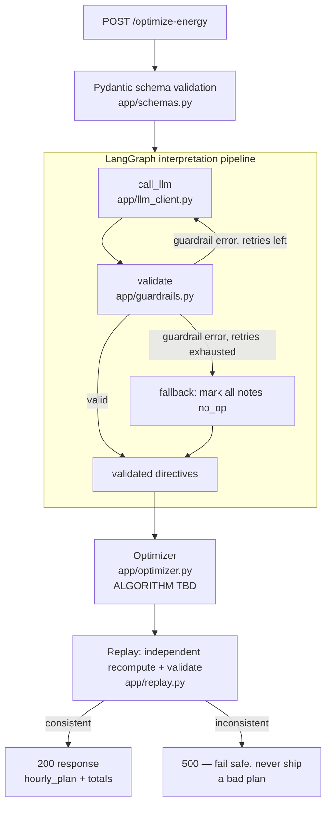

# GridWise — Architecture

High-level request flow for the LLM-assisted energy optimizer. The optimization
algorithm itself (`app/optimizer.py`) is still being built by the algorithm
team — this doc covers the pipeline around it: what goes in, what comes out,
and where the algorithm plugs in.

## Flow

## Stages

1. **Request in** (`app/main.py`) — raw JSON validated against `ScenarioRequest`
   (`app/schemas.py`): scenario id, operator notes, 24 hourly demand/solar/tariff
   rows, battery spec. Structurally invalid requests are rejected with 400
   before anything else runs.

2. **Directive interpretation** (`app/graph.py`, `app/llm_client.py`,
   `app/guardrails.py`) — operator notes are free text ("wash panels from noon
   until 2pm", "keep 50% reserve after 6pm"). An LLM call converts each note
   into one structured directive (`solar_reduction`, `no_charge_window`,
   `minimum_battery_reserve`, `no_discharge_window`, `max_grid_window`, or
   `no_op`). The LLM's raw output is never trusted directly — `guardrails.py`
   deterministically checks shape, hour ranges, and enum values. On failure the
   LLM is retried (feeding back the guardrail error) up to `LLM_MAX_RETRIES`
   times; if still invalid, every note is marked `no_op` rather than guessing —
   a directive interpretation always comes out the other side, valid or empty.

3. **Optimization** (`app/optimizer.py`) — takes the 24-hour demand/solar/tariff
   data, battery spec, and the validated directives, and produces an hourly
   plan (grid draw, solar used, battery charge/discharge) that minimizes cost
   under the directive constraints. **This is the piece the algorithm team owns.**
   Everything upstream (interpretation) and downstream (replay) is stable and
   does not depend on which algorithm/solver lives here — today it's a PuLP LP
   model per the scaffold, but the interface (hours + battery + directives in,
   `hourly_plan` out) is the contract to build against.

4. **Replay / independent verification** (`app/replay.py`) — recomputes
   `total_grid_kwh`, `total_cost_bdt`, `peak_grid_kwh` directly from the
   optimizer's `hourly_plan` and re-checks every constraint (energy balance,
   battery limits, directive compliance, end-of-day neutrality). This mirrors
   what the hidden judge does. If the optimizer's plan doesn't hold up under
   independent recomputation, the API returns 500 instead of shipping a
   plan that looks fine but isn't self-consistent.

5. **Response out** — `hourly_plan`, the directive interpretation, and the
   replay-derived totals are returned per `OptimizeEnergyResponse`.

## Why the split

- **LLM output is untrusted input.** Guardrails + retry + safe fallback mean
  a flaky or wrong LLM response degrades to "no directives applied," never a
  crash or an invented constraint.
- **Optimizer is swappable.** As long as it consumes `(hours, battery,
  directives)` and returns a plan with the required per-hour fields, the
  algorithm team can iterate on the solving strategy without touching
  interpretation or verification.
- **Replay is the safety net.** The optimizer's own reported totals are never
  shipped as-is — they're recomputed independently so a subtle optimizer bug
  fails loud (500) instead of shipping a silently wrong plan.
