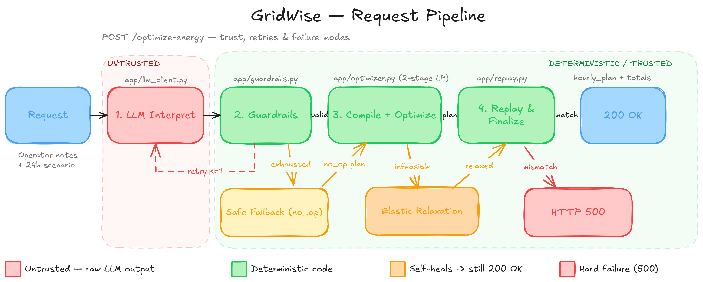
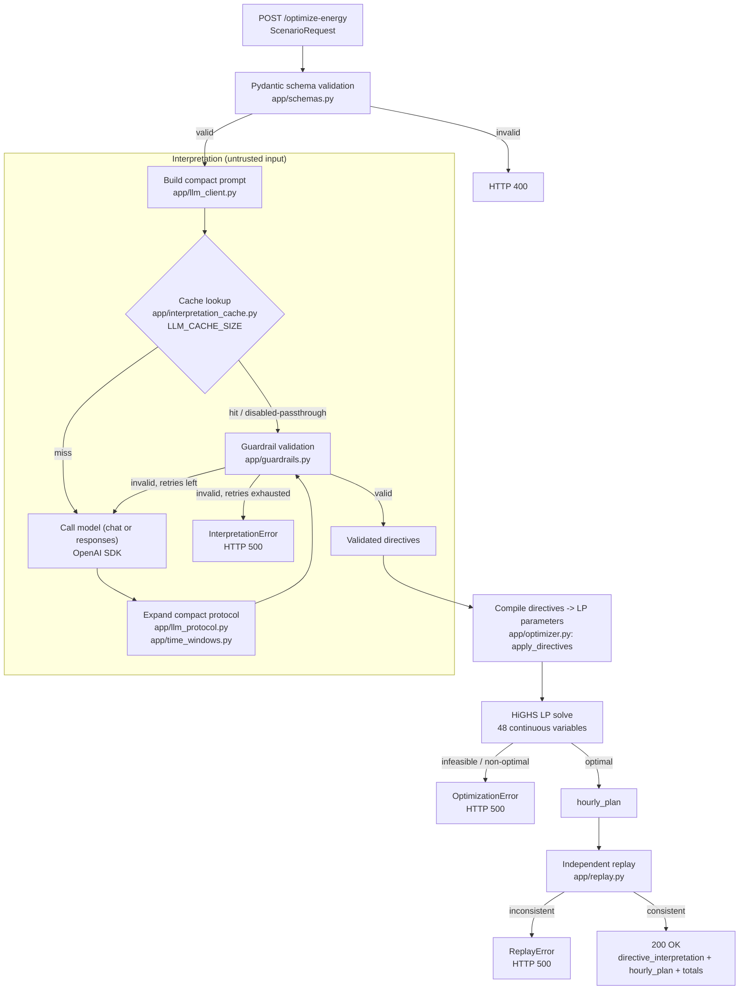

# GridWise — Overall Architecture

End-to-end request flow for `POST /optimize-energy`: an LLM interprets free-text
operator notes into structured directives, deterministic guardrails validate
them before they ever touch the optimizer, and an independent replay stage
re-verifies the final plan before it's returned. See `docs/OPTIMIZER.md` for
the LP formulation itself.

## At a glance

*Red = untrusted LLM output, green = deterministic code, blue = request/response.
The detailed flow below expands each stage, including caching and error paths.*

## Flow

## Stage responsibilities

| Stage | Module | Responsibility |
|---|---|---|
| Schema validation | `app/schemas.py` | Reject structurally invalid requests before any paid call |
| Prompt build + cache | `app/llm_client.py`, `app/interpretation_cache.py` | One model call per scenario; optional in-memory cache (off by default) |
| Model call | OpenAI SDK (chat or responses mode) | Returns a compact numeric directive protocol, not free text |
| Protocol expansion | `app/llm_protocol.py`, `app/time_windows.py` | Deterministically expand compact output into the public directive schema; generate explanations locally |
| Guardrails | `app/guardrails.py` | Deterministically validate every directive's shape, types, ranges, hour semantics — LLM output is never trusted directly |
| Retry / fail-safe | `app/graph.py` (LangGraph) | `call_llm → validate → retry (≤2) → fail`; no directive is ever invented on exhaustion |
| Optimization | `app/optimizer.py` | Compile validated directives into LP constraints, solve with HiGHS (see `docs/OPTIMIZER.md`) |
| Replay | `app/replay.py` | Independently recompute physics/totals from the plan; mirrors what a hidden judge does |
| Response | `app/main.py` | Only replay-verified totals are ever returned |

## Why the split

- **LLM output is untrusted input, always.** Every path from the model to the
  optimizer goes through guardrails — a flaky or wrong response degrades to a
  bounded retry then a clean failure, never a crash or an invented constraint.
- **Optimizer and replay are independent implementations.** The optimizer's own
  directive compiler and replay's directive compliance check don't share code,
  so a bug in one is unlikely to also be present in the other — replay disagreeing
  with the optimizer fails the request instead of shipping a self-inconsistent plan.
- **Caching is opt-in and observable.** `LLM_CACHE_SIZE=0` by default; every
  response's `X-Interpretation-Cache` header states whether that request's
  interpretation was `hit`, `miss`, or `disabled`, so behavior is never silently
  ambiguous.
