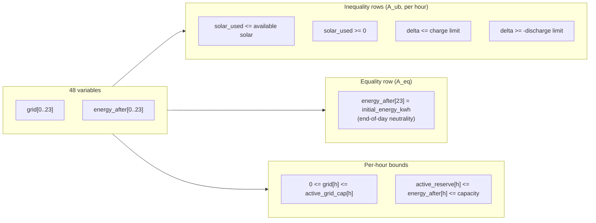
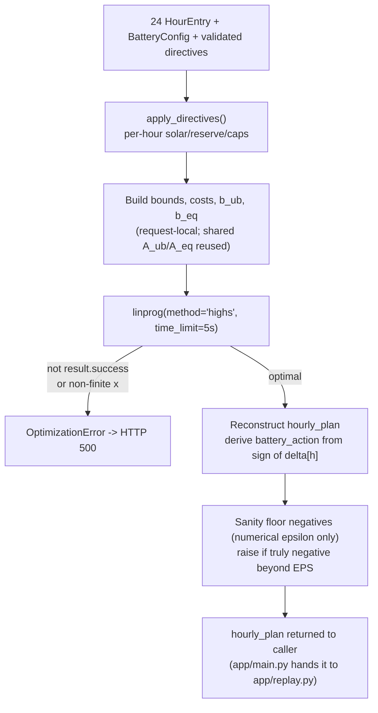

# GridWise — Optimizer Architecture

`app/optimizer.py`: an exact continuous linear program solved once per request
by SciPy's in-process HiGHS solver (`scipy.optimize.linprog(method="highs")`).
No heuristics, no MILP relaxation — every solve is a global optimum for the
given directives, or the request fails.

## Variable layout

48 continuous decision variables, indexed `0..47`, built once at import as a
fixed sparse pattern (`_A_UB`, `_A_EQ`) — only bounds/costs/RHS are request-local:

```
x[0:24]   = grid[h]           grid import in hour h        (cost coefficient = tariff[h])
x[24:48]  = energy_after[h]   battery energy at end of hour h   (cost coefficient = 0)
```

Battery charge/discharge is **not** a separate variable — it's derived from the
signed difference between consecutive `energy_after` values:

```
delta[h]      = energy_after[h] - energy_after[h-1]     (energy_after[-1] := initial_energy_kwh)
solar_used[h] = demand[h] + delta[h] - grid[h]
```

This eliminates the split charge/discharge-variable model entirely, so there is
**no binary exclusivity constraint needed** — a solver can never report
simultaneous charge and discharge in the same hour, because there is only one
number (`delta[h]`) representing net battery movement.

## Constraint matrix



```text
minimize   sum(tariff[h] * grid[h])                          for h in 0..23

subject to (per hour h):
  demand[h] - effective_solar[h]  <=  grid[h] - delta[h]  <=  demand[h]
  -discharge_limit[h]             <=  delta[h]            <=  charge_limit[h]
  active_reserve[h]               <=  energy_after[h]     <=  battery.capacity_kwh
  0                                <=  grid[h]              <=  active_grid_cap[h]   (unbounded if uncapped)

end-of-day:
  energy_after[23] = battery.initial_energy_kwh
```

Free solar can be curtailed (`solar_used <= available` is a `<=`, not `=`), but
grid export is never allowed (`grid[h] >= 0`, no negative bound). The battery
model is lossless — no round-trip efficiency loss — matching the challenge spec.

## Directive compilation (`apply_directives`)

Validated directives (already guardrail-checked — see `docs/ARCHITECTURE.md`)
are folded into per-hour LP parameters *before* the LP is built. Directives never
touch the solver directly; they only ever narrow `solar[h]`, `reserve[h]`,
`charge_limit[h]`, `discharge_limit[h]`, or `grid_cap[h]`.

| Directive type | Effect on LP parameter | Overlap rule |
|---|---|---|
| `solar_reduction` | `solar[h] *= factor` | **multiplicative** — two overlapping reductions compound |
| `minimum_battery_reserve` | `reserve[h] = max(reserve[h], minimum_energy_kwh)` | **strictest wins** (highest floor) |
| `no_charge_window` | `charge_limit[h] = 0` | binary — any directive in the hour zeroes it |
| `no_discharge_window` | `discharge_limit[h] = 0` | binary — any directive in the hour zeroes it |
| `max_grid_window` | `grid_cap[h] = min(grid_cap[h], max_grid_kwh)` | **strictest wins** (lowest cap) |

`no_op` directives are skipped entirely (`if not directive.applies: continue`).
These overlap rules are an implementation choice where the organizer spec is
silent — see the Limitations section in the main README.

## Solve → response



Post-solve, the optimizer reconstructs each hour's `battery_action` purely from
the sign of `delta[h]` (`charge` / `discharge` / `idle`), snapping tiny
numerical noise (`abs(movement) <= 1e-9`) to exactly idle. Any negative value
beyond solver epsilon (`EPS = 1e-7`) is treated as a solver bug, not clamped
silently — `OptimizationError` is raised rather than shipping a physically
invalid plan.

**Important:** `app/replay.py` deliberately does **not** call
`apply_directives()` — it has its own independent directive-compliance check
against the raw JSON response, so a bug in this compiler alone cannot pass
replay. See `docs/ARCHITECTURE.md` for how replay fits into the full pipeline.

## Why this design

- **Concurrency-safe by construction.** The sparse constraint pattern
  (`_A_UB`, `_A_EQ`) is built once at import and never mutated; every `solve()`
  call only supplies its own bounds/costs/RHS arrays, so concurrent requests
  cannot corrupt each other's solve.
- **48 variables is deliberately minimal.** No slack variables for directives,
  no binary switches — every directive is expressed as a bound tightening on
  the same 48 variables, keeping the LP small and the solve fast (median ~1ms
  offline, per the main README's public-sample timing).
- **Correctness over cleverness.** `time_limit=5s` and tight feasibility
  tolerances (`1e-9`) mean the solver either proves optimality or the request
  fails loud — there's no silent near-optimal fallback.
